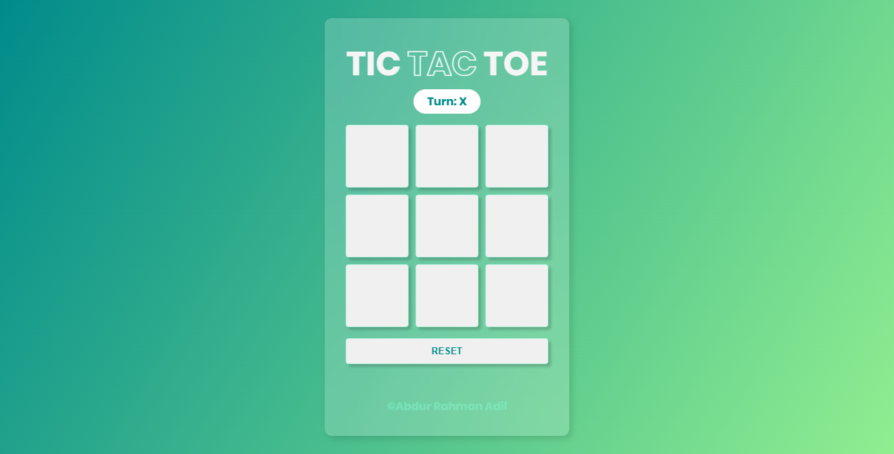
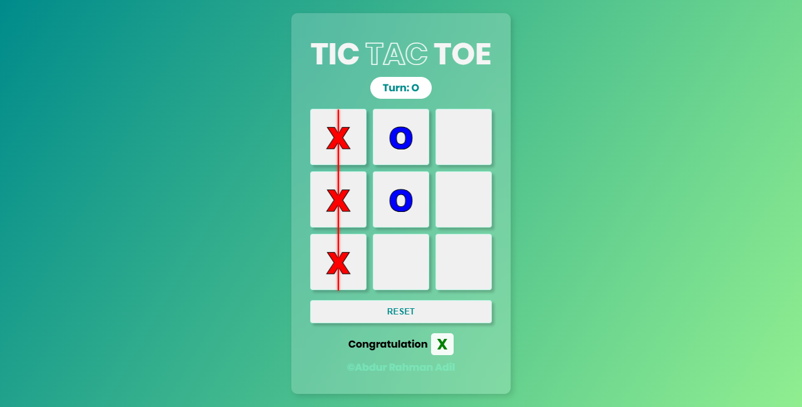
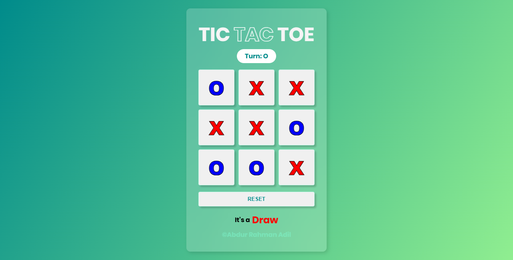

# Tic Tac Toe Game

A beautiful and interactive Tic Tac Toe game built with HTML, CSS, and JavaScript featuring smooth animations and a modern glassmorphic design.






## 🎮 Features

- **Two Player Mode**: Play with a friend on the same device
- **Turn Indicator**: Clear display showing whose turn it is (X or O)
- **Win Detection**: Automatically detects winning patterns with animated line
- **Draw Detection**: Identifies when the game ends in a draw
- **Visual Feedback**: Different colors for X (red) and O (blue) players
- **Animated Win Line**: Displays a colored line through winning combination
- **Reset Function**: Quick reset button to start a new game
- **Responsive Design**: Works on various screen sizes
- **Modern UI**: Glassmorphic design with gradient background

## 📁 Project Structure

```
tic-tac-toe/
│
|__ assets              # Assets here
├── index.html          # Main HTML file
├── css/
│   ├── style.css       # Main styles
│   └── responsive.css  # Responsive styles
├── js/
│   └── script.js       # Game logic
└── README.md           # Project documentation
```

## 🚀 Getting Started

### Prerequisites

- A modern web browser (Chrome, Firefox, Safari, Edge)
- No additional dependencies required!

### Installation

1. **Open the game**
   - Simply open `index.html` in your web browser
   - Or use a local server:
     ```bash
     # Using Python 3
     python -m http.server 8000
     
     # Using Node.js (http-server)
     npx http-server
     ```

## 🎯 How to Play

1. The game starts with Player X
2. Click on any empty square to make your move
3. Players alternate between X and O
4. First player to get 3 in a row (horizontal, vertical, or diagonal) wins
5. If all squares are filled without a winner, the game is a draw
6. Click "Reset" button to start a new game

## 🎨 Game Features Breakdown

### Win Patterns
The game checks for 8 possible winning combinations:
- 3 horizontal lines
- 3 vertical lines
- 2 diagonal lines

### Visual Indicators
- **X Player**: Red color with red glow on win
- **O Player**: Blue color with blue glow on win
- **Win Line**: Animated line that appears through winning combination
- **Turn Display**: Shows current player's turn at the top

### Game States
- **Playing**: Active game where players take turns
- **Won**: A player has achieved three in a row
- **Draw**: All squares filled with no winner

## 💻 Code Highlights

### Win Detection
```javascript
const checkWinner = () => {
  for (pattern of winPattern) {
    // Check if three positions match
    // Display winning line with animation
    // Disable all buttons
  }
};
```

### Responsive Design
The game adapts to different screen sizes using the `responsive.css` file.

## 🛠️ Customization

### Change Colors
Edit `css/style.css`:
```css
/* Background gradient */
background: linear-gradient(120deg, darkcyan, lightgreen);

/* X player color */
color: red;

/* O player color */
color: blue;
```

### Adjust Board Size
Modify in `css/style.css`:
```css
.btn {
  width: 90px;  /* Change width */
  height: 90px; /* Change height */
}
```

## 🐛 Known Issues

- None at the moment

## 🔮 Future Enhancements

- [ ] Add single player mode (vs AI)
- [ ] Implement difficulty levels
- [ ] Add sound effects
- [ ] Score tracking across multiple games
- [ ] Animation improvements
- [ ] Theme customization
- [ ] Mobile app version

## 📄 License

This project is open source and available under the [MIT License](LICENSE).

## 👨‍💻 Author

**Abdur Rahman Adil**


## 📞 Support

If you have any questions or need help, feel free to reach out or open an issue.

## ⭐ Show Your Support

Give a ⭐️ if you like this project!

---

**Enjoy playing Tic Tac Toe!** 🎮